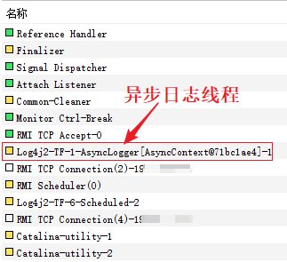

# hi-springboot-log4j2
spring boot log4j2 demo

## 说明

hi-springboot-log4j2 是一个专注于展示如何在 Spring Boot 项目中使用 Log4j2 进行日志记录的示例项目。它的目标是帮助开发者快速理解并实施 Log4j2 与 Spring Boot 的集成，同时提供一些最佳实践和配置示例。

1. springboot项目默认加载log4j2-spring.xml文件
2. log4j2-spring.xml配置参数支持引用application.yml
3. 启用log4j2异步，提高日志性能


### 异步日志

- 如何判断log4j2异步日志是否生效

1. 本项目运行后会输出日志

   ```
   是否为异步日志：true
   ```


2. 使用Java VisualVM等内存分析工具查看

 


## version
- openJDK 21
- gradle 8.10.2
- spring boot 3.3.4
- log4j2 2.23.11
- disruptor 3.4.4


## reference

- Spring Boot: Configure Log4j for Logging

  https://docs.spring.io/spring-boot/how-to/logging.html#howto.logging.log4j.composite-configuration

- Log4j: Spring Boot Support

  https://logging.apache.org/log4j/2.x/log4j-spring-boot.html

- Log4j: Asynchronous Loggers for Low-Latency Logging

  https://logging.apache.org/log4j/2.x/manual/async.html


